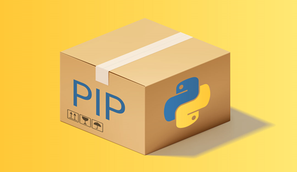

# pyaparat



Hello my friends this is [Mr.Rezoo](https://www.linkedin.com/in/reza-mobaraki/)

## Table of contents

* [General info](#General-info)
* [Technologies](#Technologies)
* [Help](#Help)
* [Setup](#Setup)
* [Credits](#credits)
* [Contributors](#Contributors)
* [License](#license)

## General info

build scraper to download video from www.aparat.com

## Technologies

Project is created with:

* Python: 3.9.4
* bs4: 4.9.3
* requests: 2.25.1


## Help

If you are considering a particular method, more modern technology Add to my
project and send merge request, I will add you in the credits and contributors
section

## Setup

* first step : create virtual environment

```shell
virtualenv -p python3 venv 
```

* second step : activate virtual environment

```shell
source venv/bin/activate  
```

* third step : install package | library from requirements.txt

```shell
 pip install -r requirements.txt
```
* last step `follow the directories`

## Credits

* [mongard](https://www.mongard.ir/courses/pyaparat/)

## Contributors

* [MrRezoo](https://github.com/MrRezoo)

## License

Distributed under the MIT License. See [license](LICENSE) for more information.
